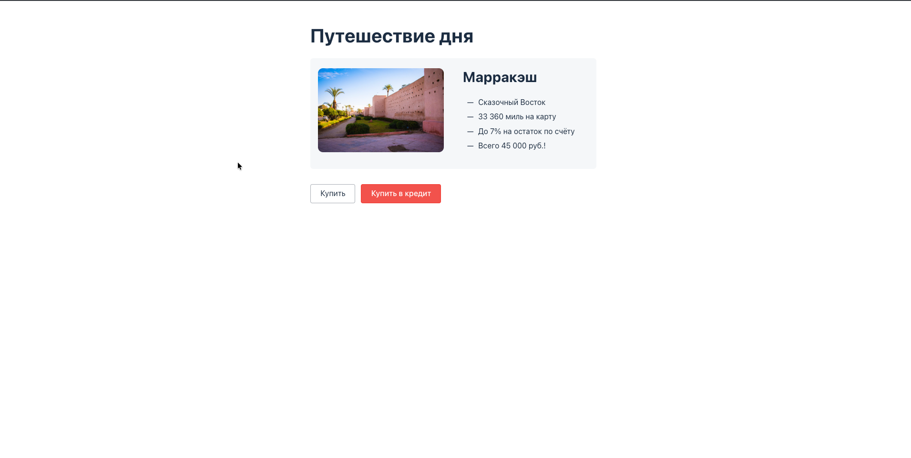
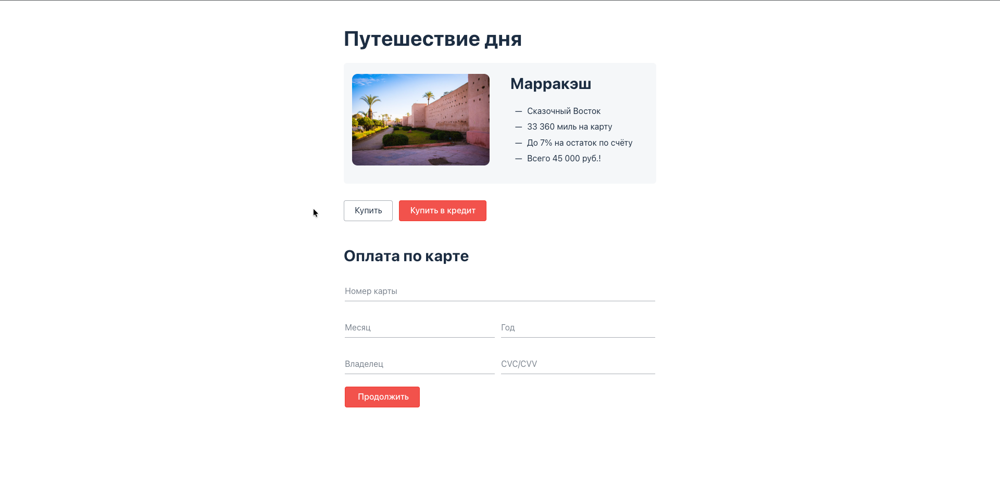
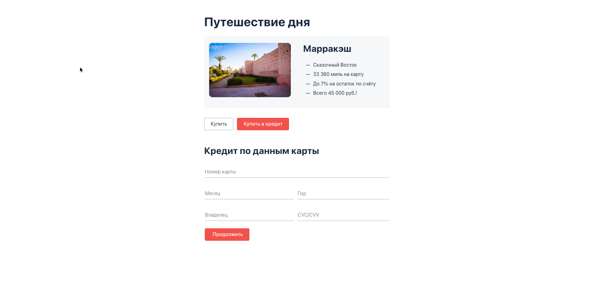
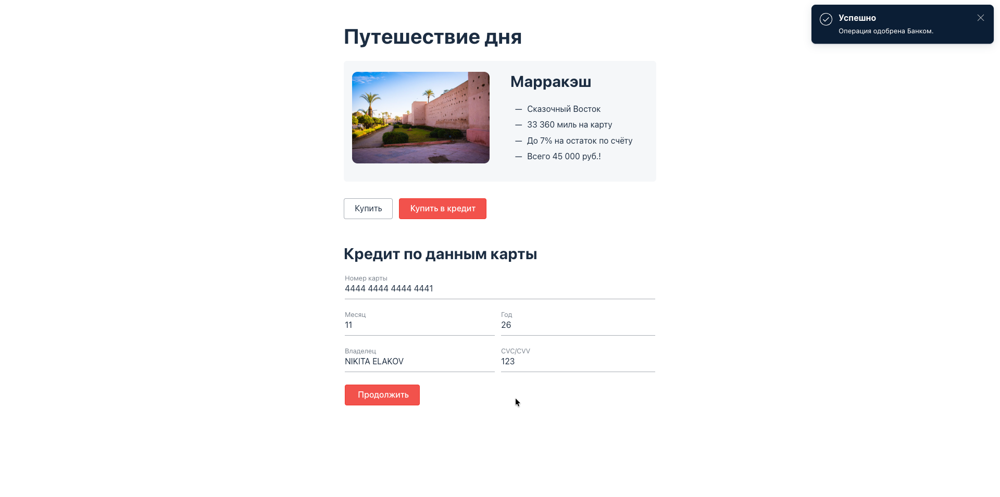
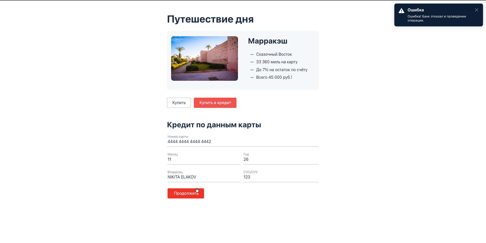
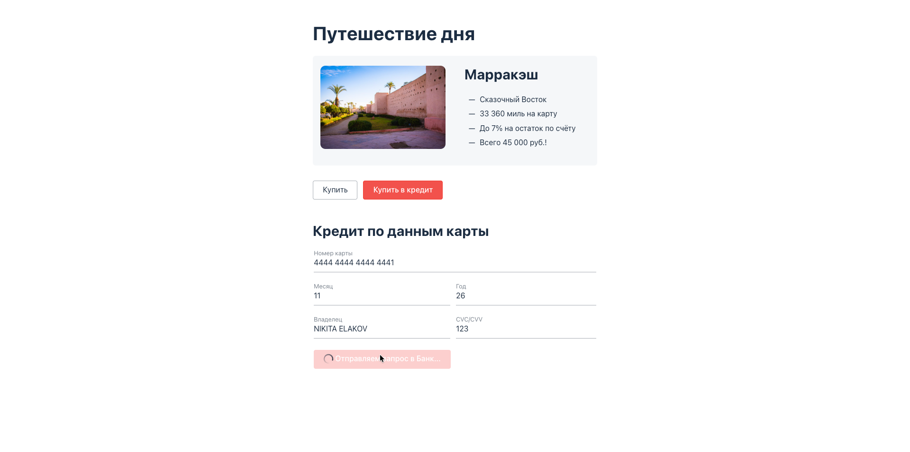
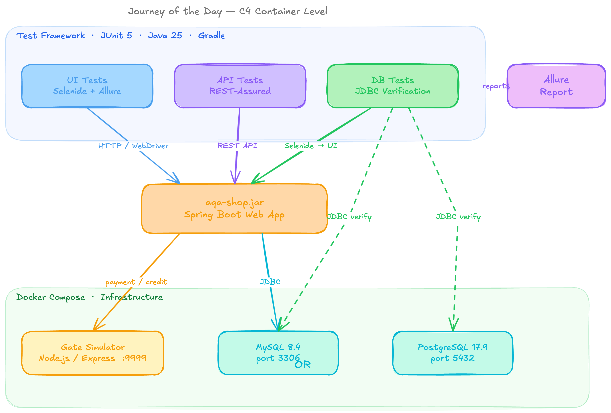
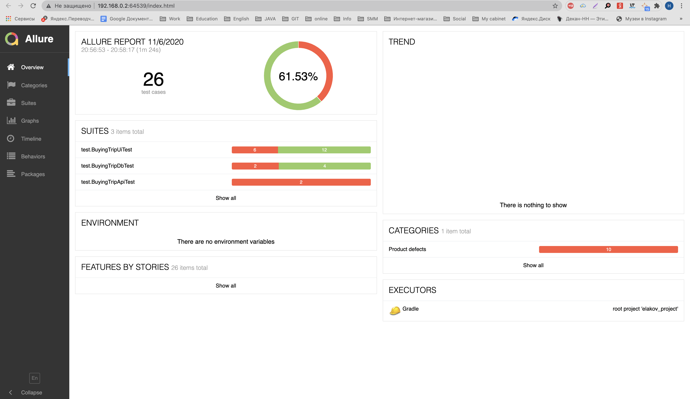

<p align="center">
  <h1 align="center">🧪 Journey of the Day — Test Automation Framework</h1>
  <p align="center">
    Multi-layer test automation for a tour-booking web application<br/>
    <strong>UI · API · Database</strong> — all in one framework
  </p>
</p>

<p align="center">
  
  
  
  
  
  
  
</p>

---

## About

**Journey of the Day** is a test automation framework for an [Alfa-Bank](https://alfabank.ru/) web service — a Spring Boot tour-booking application with integrated payment processing. The SUT offers two purchase flows — direct debit card payment and bank credit — both routed through a simulated payment gateway. This framework validates the entire vertical: from the browser UI through REST endpoints down to the database state.

The project was developed as a diploma capstone for [Netology's](https://netology.ru/) QA Automation program ([certificate](https://netology.ru/sharing/6f7576bbc619a45373ef783483cab60d?utm_source=social&utm_campaign=certificate_lms)). It demonstrates a production-grade approach to test architecture with clean separation of concerns, dual-database support, and containerized infrastructure.

### Documentation

| Document | Description |
|:---------|:------------|
| [Automation Plan](docs/Plan.md) | Test scenarios, risk analysis, tooling rationale |
| [Test Report](docs/Report.md) | Detailed results with Allure screenshots |
| [Automation Summary](docs/Summary.md) | Final metrics: 26/26 scenarios, ~65 hours |

---

## Application UI

The SUT is a single-page tour-booking application. Below are the key screens that the test framework interacts with.

**Landing page** — the starting point with two purchase options:

<p align="center">
  
</p>

**Payment & Credit forms** — identical layout, different processing paths:

<p align="center">
  
  
</p>

**Transaction results** — the notifications that UI tests assert on:

<p align="center">
  
  
</p>

<details>
<summary>Loading state (intermediate)</summary>
<p align="center">
  
</p>
</details>

---

## Architecture

<p align="center">
  
</p>

The framework tests three layers of the application stack:

**Key design decisions:**

- **Page Object Model** — `FormPage` base class with `PaymentPage` / `CreditPage` inheriting heading text and timeout configuration. Fluent navigation via `StartPage`.
- **Immutable test data** — Java `record Card(number, month, year, holder, cvc)` as the single data carrier across all layers.
- **Dynamic dates** — `DataGenerator` computes expiry dates relative to `YearMonth.now()`, so tests never rot due to hardcoded dates.
- **Dual-database support** — same test suite runs against MySQL and PostgreSQL, switched by a single `-Ddb.url` parameter.
- **Gate Simulator** — lightweight Express.js service that returns APPROVED/DECLINED based on card number lookup, simulating the bank payment gateway.

---

## Test Coverage

| Suite | Class | Tests | Layer | What it validates |
|:------|:------|:-----:|:------|:------------------|
| UI | `BuyingTripUiTest` | 18 | Browser | Form validation, expiry logic, parameterized CSV-driven field checks |
| API | `BuyingTripApiTest` | 2 | REST | Rejects invalid card holder data at API level |
| DB | `BuyingTripDbTest` | 6 | Full stack | UI → SUT → DB state: APPROVED, DECLINED, unknown card scenarios |
| **Total** | | **26** | | |

All UI and DB tests run against both **Payment** and **Credit** flows.

---

## Tech Stack

| Category | Technology | Version |
|:---------|:-----------|:--------|
| Language | Java (OpenJDK) | 25 |
| Build | Gradle | 9.4.1 |
| Test Framework | JUnit Jupiter | 5.14.3 |
| UI Testing | Selenide | 7.15.0 |
| API Testing | REST-Assured | 6.0.0 |
| Reporting | Allure | 2.33.0 |
| Database | MySQL | 8.4.8 |
| Database | PostgreSQL | 17.9 |
| DB Access | Commons-DbUtils | 1.8.1 |
| Serialization | Gson | 2.13.2 |
| Code Gen | Lombok | 9.2.0 (plugin) |
| Remote Browser | Selenium Grid 4 | standalone-chromium |
| Infrastructure | Docker Compose | v2+ |

---

## Prerequisites

- **Java 25+** — [Download](https://jdk.java.net/25/)
- **Docker & Docker Compose** — [Install](https://docs.docker.com/get-docker/)
- **Browser** — Chrome or Firefox (Selenide auto-manages WebDriver)

---

## Quick Start

**1. Clone the repository**

```bash
git clone https://github.com/nelakov/alfabank-journey-of-the-day-autotests.git
cd alfabank-journey-of-the-day-autotests
```

**2. Start infrastructure**

```bash
docker-compose up -d --build
```

This spins up the gate simulator (port 9999), MySQL (port 3306), PostgreSQL (port 5432), Selenium Grid (port 4444), and noVNC viewer (port 7900).

**3. Start the SUT**

With MySQL (default):
```bash
java -jar artifacts/aqa-shop.jar &
```

With PostgreSQL:
```bash
java -jar artifacts/aqa-shop.jar \
  --spring.datasource.url=jdbc:postgresql://localhost:5432/app &
```

The application will be available at `http://localhost:8080`.

**4. Run tests**

```bash
# Against MySQL
./gradlew test -Ddb.url=jdbc:mysql://localhost:3306/app

# Against PostgreSQL
./gradlew test -Ddb.url=jdbc:postgresql://localhost:5432/app

# Headless mode (CI)
./gradlew test -Dselenide.headless=true -Ddb.url=jdbc:mysql://localhost:3306/app

# Through Selenium Grid (browser runs in Docker container)
./gradlew test -Ddb.url=jdbc:mysql://localhost:3306/app \
  -Dselenide.remote=http://localhost:4444/wd/hub \
  -Dsut.url=http://host.docker.internal:8080/
```

**5. View Allure report**

```bash
./gradlew allureServe
```

---

## Running Specific Tests

```bash
# Single test class
./gradlew test --tests "test.BuyingTripDbTest"

# Single test method
./gradlew test --tests "test.BuyingTripDbTest.shouldConfirmPaymentWithValidCard"

# UI tests only
./gradlew test --tests "test.BuyingTripUiTest"
```

---

## Project Structure

```
alfabank-journey-of-the-day-autotests/
├── artifacts/
│   └── aqa-shop.jar              # SUT — Spring Boot application
├── gate-simulator/                # Payment gateway mock
│   ├── app.js                     # Express.js server (APPROVED/DECLINED logic)
│   ├── data.json                  # Card number → status mapping
│   └── Dockerfile
├── src/test/
│   ├── java/
│   │   ├── data/
│   │   │   └── Card.java          # Immutable record — test data carrier
│   │   ├── page/                  # Page Object Model
│   │   │   ├── StartPage.java     # Landing page — navigation hub
│   │   │   ├── FormPage.java      # Base form: fields, fill, assertions
│   │   │   ├── PaymentPage.java   # Extends FormPage — debit payment
│   │   │   └── CreditPage.java    # Extends FormPage — credit payment
│   │   ├── utils/
│   │   │   ├── DataGenerator.java # Card fixtures with dynamic dates
│   │   │   ├── ApiClient.java     # REST-Assured wrapper
│   │   │   └── DbClient.java      # JDBC queries via Commons-DbUtils
│   │   └── test/
│   │       ├── BuyingTripUiTest.java   # Parameterized form validation
│   │       ├── BuyingTripApiTest.java  # API-level rejection tests
│   │       └── BuyingTripDbTest.java   # Full-stack integration tests
│   └── resources/
│       └── incorrectValues.cvs    # CSV test data for parameterized tests
├── docs/
│   ├── Plan.md                    # Automation plan & risk analysis
│   ├── Report.md                  # Test execution report
│   ├── Summary.md                 # Final automation summary
│   ├── architecture.png           # C4 architecture diagram
│   ├── ui-landing-page.png        # SUT: start page
│   ├── ui-payment-form.png        # SUT: debit card form
│   ├── ui-credit-form.png         # SUT: credit form
│   ├── ui-credit-approved.png     # SUT: APPROVED notification
│   ├── ui-credit-loading.png      # SUT: loading state
│   └── ui-credit-declined.png     # SUT: DECLINED notification
├── docker-compose.yml             # Gate simulator + MySQL + PostgreSQL
├── build.gradle                   # Dependencies, Allure config, test setup
└── application.properties         # SUT configuration
```

---

## Configuration

All parameters are passed as JVM system properties:

| Property | Default | Description |
|:---------|:--------|:------------|
| `db.url` | — | JDBC URL (MySQL or PostgreSQL) |
| `db.user` | `app` | Database username |
| `db.password` | `pass` | Database password |
| `sut.url` | `http://localhost:8080/` | SUT base URL |
| `selenide.headless` | `false` | Run browser in headless mode |

---

## Database Schema

The SUT uses three tables (auto-created by Spring Boot):

| Table | Purpose | Key Column |
|:------|:--------|:-----------|
| `order_entity` | Created on every successful transaction | `id` |
| `payment_entity` | Debit payment result | `status` (APPROVED / DECLINED) |
| `credit_request_entity` | Credit payment result | `status` (APPROVED / DECLINED) |

Card data is **never persisted** — only transaction statuses are stored.

---

## Gate Simulator

The gate simulator is a minimal Express.js service that mimics the bank payment gateway:

| Card Number | Status |
|:------------|:-------|
| `4444 4444 4444 4441` | APPROVED |
| `4444 4444 4444 4442` | DECLINED |
| Any other | HTTP 400 |

It listens on port **9999** and handles both `/payment` and `/credit` endpoints.

---

## Selenium Grid

The framework supports remote browser execution via [Selenium Grid 4](https://www.selenium.dev/documentation/grid/) Standalone. When enabled, tests run inside a Docker container with Chromium — no local browser installation required.

| Service | Port | Purpose |
|:--------|:-----|:--------|
| Selenium Grid | 4444 | WebDriver endpoint |
| noVNC | 7900 | Live browser view — open `http://localhost:7900` |
| Video Recorder | — | Records each session, attaches to Allure on failure |

**Video on failure**: `VideoAttachExtension` (JUnit `TestWatcher`) automatically attaches the recorded video to the Allure report when a test fails. Successful test recordings are deleted to save disk space.

Pass `-Dselenide.remote=http://localhost:4444/wd/hub` to enable Grid mode. Without this flag, tests use the local browser.

---

## Allure Report

After running tests, generate the interactive Allure report:

```bash
./gradlew allureServe
```

The report includes test execution details, step-by-step Selenide logs, and screenshots on failure.

<p align="center">
  
</p>

---

## License

This project is a demonstration/educational framework. Feel free to use it as a reference for your own test automation projects.
